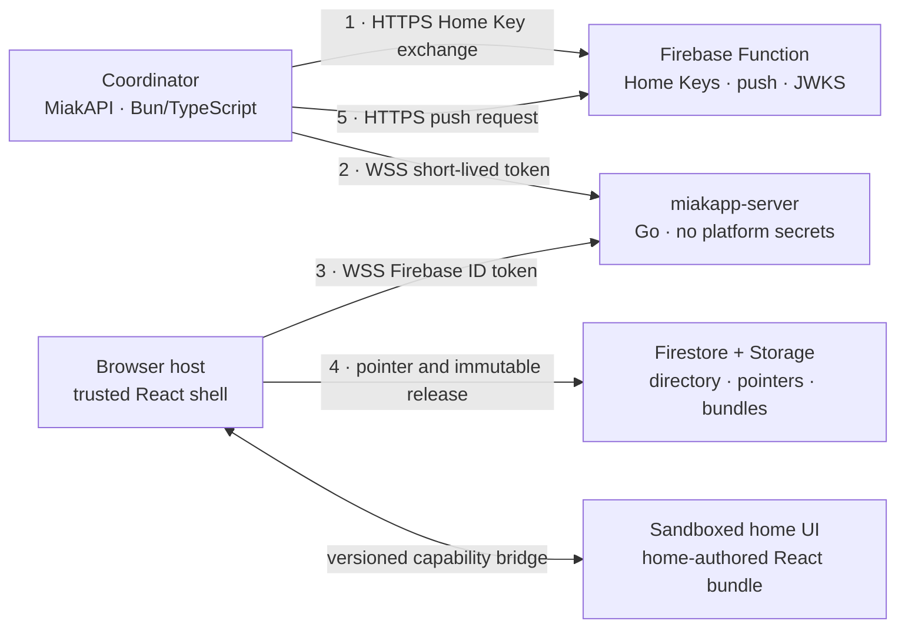

# Miakapp 3.5 — Design

Date: 2026-08-29
Status: architecture approved; wire and component-runtime contracts accepted;
other contracts in progress
Scope: the Miakapp ecosystem. This document is the shared contract between the
web app, `miakapp-server` (rewritten in Go), MiakAPI and the Firebase Functions.
Each repository derives its own implementation plan from it.

The web app's own rebuild and MiakAPI's future shape are not covered here; they
need their own design passes. The exact wire format is RFC 0001 and the component
capability boundary is RFC 0002. The platform control plane, MiakAPI surface and
migration procedure remain explicit design gates. A repository may proceed only
through the gates required by its current vertical slice (§ 19).

---

## 1. Context

Miakapp relays a home's state in real time between a **coordinator** (a program
running at the user's home, behind NAT) and **users** (browsers).
`miakapp-server` is the mandatory hop, because the coordinator has no public
address.

Moving to 3.5 changes what the server *is*: it stops being a relay that carries
business logic and becomes a **generic data bridge**. All application logic —
users, permissions, invitations — moves down into the coordinator, which is
written by an AI agent.

### Why a rewrite

Auditing the v3 server surfaced structural defects, not isolated bugs:

| Finding | Detail |
|---|---|
| The "optimised" codec is larger than JSON | Measured: 56 B vs 49 B. `miakode` produces a string, which `Buffer.from()` re-encodes as UTF-8; every character ≥ 0x80 becomes two bytes. |
| The codec does not compute the minimum it thinks it does | `m > c` compares a `number` to a `string`, always `false`. The "minimum" is the first character's code. The round-trip holds by luck. |
| The rate limiter limits nothing | `wsServer.js` writes `.l` and reads `.last` (`undefined`) → `NaN`, so the condition is never true. `.i` stays at 0. |
| Guaranteed memory leak | `Home.destroy()` is never called: a home seen once keeps its Firestore listeners open until restart. |
| Artificial latency floor | Every `COMMIT` resends the full state to every user, re-filtered and re-encoded per socket. No diffing. |
| Useless application-level heartbeat | A round trip every 5 s, when RFC 6455 provides control frames the browser answers inside the network stack. |
| Security | Hard-coded origin allowlist, `firebase-admin@9` (2021), no tests. |

### Deployment shape

Miakapp is not yet deployed at a scale that constrains the migration: there is
no fleet of third-party installations to protect, and the whole dataset fits
comfortably in a single JSON export.

That is what makes a **final platform cutover** viable without a permanent
compatibility layer (see § 16). It does not remove the need for beta, shadow,
canary and rollback validation. A project with third-party operators would have
to decide differently.

---

## 2. What goes away

- `miakode` — replaced by MessagePack plus a path dictionary.
- The application-level `PING`/`PONG` heartbeat — replaced by WebSocket control frames.
- Platform-side groups, permissions, pages and invitations.
- The `relations` Firestore collection and its ~120 lines of rules.
- The Coordinator Secret — replaced by Home Keys.
- The Firestore read in the user authentication path.
- Firebase credentials inside the server.
- `.devcontainer/`, `.vscode/`, and every mention of abandoned tooling.

---

## 3. Target architecture

1. The coordinator exchanges its Home Key for its server address and a short-lived token.
2. It connects to the server with that token.
3. The user connects with their Firebase ID token.
4. The browser host reads the component pointer from Firestore, verifies the
   release, and loads it in a sandboxed, non-credential-bearing context.
5. The coordinator requests a push through the Function.

**The server holds no platform secrets.** It only verifies signatures with
public keys and makes no authenticated outbound calls. It still receives
plaintext home data in 3.5; the selected relay is therefore trusted by the home
for confidentiality and correct routing (§ 4).

---

## 4. Trust model

| Party | Trust | Consequence |
|---|---|---|
| Firebase Auth | identity root | provides `uid` and `email_verified` |
| Firebase Function | platform root | sole holder of platform signing, push and Home Key material |
| Coordinator | trusted within its own home | application permission authority; deployed agent output is reviewed as ordinary privileged code |
| miakapp-server | **platform-untrusted, home-data-trusted** | anyone may host one; never receives a platform secret, but sees plaintext home state |
| Browser host | trusted platform client | holds Firebase identity and enforces the component capability boundary |
| Home UI bundle | untrusted by the platform | executes in a sandbox without ambient Firebase credentials or host-origin authority |

Two properties follow from the server being **platform-untrusted**:

- The Function never talks to it. The coordinator is the caller (§ 5.2).
- The short-lived token carries an `aud` claim naming the destination server;
  otherwise a malicious server could replay a captured token against the
  official server to impersonate the coordinator.

This is not end-to-end encryption. A relay that terminates WSS can observe,
alter, replay, misroute, delay or drop application messages. A home must trust
its selected relay operator for those properties. Making the relay blind would
require a separate end-to-end key, membership, recovery and revocation design;
that work is deferred (§ 17).

---

## 5. Authentication

### 5.1 Users

Firebase ID token, verified **locally** by the server: RS256 signature against
Google's JWKS, cached per the response's `Cache-Control` (several hours). No
network call per connection, no Firestore read.

Verification pins the algorithm and validates `kid`, project `aud`, exact
issuer, non-empty subject, `exp`, `iat` and `auth_time`; signature verification
alone is insufficient. The ordinary local path does not check account
disablement or server-side token revocation.

The server extracts `uid`, `email` and `email_verified`, and forwards the email
to the coordinator **only if it is verified**. Without that rule, anyone can
sign up with someone else's address and claim their invitation.

An established socket does not become unauthenticated merely because the token
presented at `HELLO` expires. The browser therefore refreshes its Firebase ID
token and sends `REAUTH` before expiry (45 minutes by default). Failure closes
the socket. This bounds account-disablement and session-revocation propagation
to the Firebase token lifetime unless a later online revocation check is added.
Home membership changes are independent: the coordinator removes or changes the
user's declarations and the relay applies the change immediately.

### 5.2 Coordinators and CLI

A refresh/access token split:

1. The coordinator calls the Function with its **Home Key** (256 bits, no
   expiry, revocable).
2. The Function verifies the key, rate-limits on the caller's IP, and returns:
   the server host to use, a signed **short-lived token** (5 min TTL, `aud` =
   that host, `sub` = homeID, the key's scopes), and the key's metadata.
3. The coordinator connects to the server and presents the token.
4. The server verifies it against the platform's public key (cached JWKS). It
   makes no authenticated outbound call; public key refresh is the only network
   dependency of verification.
5. Before the five-minute token expires (**four minutes by default**), the
   coordinator re-exchanges its Home Key and pushes the new token over the
   existing socket (`REAUTH`). Failure → disconnect.

Step 5 is what gives revocation a bounded effect on an already-established
connection. The maximum residual access is the reauthentication interval, not
the lifetime of the Home Key.

The CLI uses the exact same exchange with a distinct scope and normally closes
the connection after one operation batch.

**Why not a long-lived signed token**: a stateless token without expiry is
irrevocable by construction. Signature, absence of expiry and revocability are
pairwise incompatible; the refresh/access split is the only way to get all
three.

**Why not a server → Function call**: that would turn the Function into an
oracle queryable by the platform-untrusted relay, with the rate limit keyed on
the server's IP instead of the real caller's.

---

## 6. The 3.5 protocol

Protocol 1.0 is defined normatively by
[`RFC 0001`](../rfcs/0001-wire-protocol.md). The RFC, shared binary fixtures and
independent Go and TypeScript codecs are the contract; this architecture
document records only its consequences.

### 6.1 Transport and negotiation

The transport is one binary WebSocket at `wss://<host>/ws`, using the constant
`miakapp` WebSocket subprotocol. One WebSocket message contains exactly one
application frame. Version `[1, 0]` is negotiated in `HELLO`, so an incompatible
peer receives a stable protocol error instead of depending on browser handshake
diagnostics.

RFC 6455 Ping/Pong control frames provide liveness. The browser answers below
JavaScript. Browser handshakes use an exact `Origin` allowlist; all roles
authenticate in their first application frame and reauthenticate before their
current token deadline.

### 6.2 Encoding

Each frame is one opcode byte followed by one canonical MessagePack array. The
earlier candidate combination of custom LEB128 fields plus MessagePack was
discarded: compact MessagePack integers already provide the relevant size
property, while a second binary grammar would duplicate validation and fuzzing
work.

The Miakapp profile permits null, booleans, JavaScript-safe integers, finite
non-integral float64 values, valid UTF-8, binary, arrays and string-keyed maps.
It fixes shortest encodings and UTF-8 byte ordering for map keys, rejects
extensions and applies exact frame, depth, node and container limits before a
generic decoder can allocate from the input.

Paths, topics and function names are still interned as integer IDs for the life
of a home epoch. The optimisation now has a deterministic byte contract but must
still be benchmarked on representative traces before its operational value is
claimed.

### 6.3 Frame families

Protocol 1.0 defines forty core opcodes:

| Range | Family | Contract |
|---|---|---|
| `0x00..0x07` | session | negotiation, errors, reauthentication, status and draining |
| `0x10..0x19` | state | complete coordinator declarations, dictionaries, snapshots, revisioned patches, mutations and ACLs |
| `0x20..0x29` | events | topic declarations, event ACLs, subscriptions and at-most-once live delivery |
| `0x30..0x39` | calls | function declarations, dispatch metadata, acceptance, credit-bounded streaming, results, errors and cancellation |
| `0x40..0x41` | presence | current authenticated user sessions and changes |

Payload arity, field types, enum values, direction, limits and error numbers are
specified only in the RFC. Core opcodes are never reassigned. Unknown optional
extensions use `0x80..0xff` and are ignored only after structural validation.

### 6.4 State, calls and failure semantics

State is convergent. An authenticated user receives a complete dictionary and
snapshot before patches. Every patch names its epoch, base revision and next
revision; a mismatch stops patch application and triggers explicit
resynchronisation.

Calls are symmetric and correlated but never automatically retried. A relay
`CALL_ACCEPTED` means authenticated, authorized and queued to the callee — not
started, applied or physically observed. If dispatch may have happened and no
terminal result exists, the outcome is **unknown**. Optional idempotency keys are
coordinator-owned application contracts, not relay exactly-once delivery.

Streaming results consume explicit receiver credit. Final results and terminal
errors bypass stream credit so they cannot remain behind unbounded data. Events
remain live and at-most-once; work needing an outcome uses a call instead.

### 6.5 Authorization metadata

The relay constructs caller metadata from the authenticated socket. A client can
never choose its own UID, verified email, session ID, home or coordinator name.
Enrollment alone grants no state path, topic or function authority. Coordinator
declarations define each surface, and the coordinator still performs the final
business authorization for a dispatched call.

### 6.6 Executable contract and remaining boundary

The shared fixtures cover every core opcode, valid Unicode and binary values,
non-canonical encodings, hostile length declarations and semantic frame errors.
Both reference implementations must encode the same bytes and reject the same
invalid corpus. Go additionally exposes a coverage-guided fuzz target.

This closes the byte-contract design gate. It does not implement a relay session
machine. Role/direction enforcement, token verification, coordinator ownership,
bounded queues and disconnect fault matrices remain acceptance requirements of
the relay/SDK vertical slice.

---

## 7. Server state

Per home, in memory, with no persistence:

- the coordinator connection(s),
- the user connections,
- the full variable state,
- the path ↔ integer dictionary,
- each user's resolved allowlist, as integer sets,
- in-flight calls,
- event subscriptions.

The server **caches the full state**, which lets it serve a connecting user's
snapshot without waking the coordinator or waiting for a round trip to the home.

A server restart loses nothing durable: everyone reconnects and the coordinators
re-push their state.

Per-home and per-connection budgets bound frame size, decoded container depth
and cardinality, dynamic dictionary entries, queued bytes, subscriptions,
in-flight calls and call duration. A slow consumer is coalesced for replaceable
state and disconnected before its queue can exhaust shared memory. Control and
terminal call frames are never allowed to sit behind an unbounded data stream.

### Allowlists

Exact paths and prefixes (`salon.*`). The coordinator declares them; the server
resolves them once into identifier sets and only re-evaluates when a new path
appears. Hot-path filtering becomes an integer set-membership test.

An entry may name a path that does not exist yet; it will apply when it appears.
Variables and allowlists are two independent namespaces.

The presence of an ACL entry enrols a user even when its pattern list is empty.
This distinguishes an enrolled user with deliberately zero visible variables
from an unknown user.

---

## 8. Multiple coordinators

A home accepts several simultaneous coordinators, each owning a domain — for
example one for users and their rights, others for distinct slices of the data.

This is namespace sharding, not active-active redundancy. Two coordinators must
not concurrently control the same physical actuator merely because the relay
accepts both sockets. Redundancy for a physical effect requires fencing at the
resource boundary and is out of scope for 3.5.

**Identity**: a coordinator connects with a name. Uniqueness on (home, name).
Same name → the previous one is evicted. Different name → they coexist.

**Central rule: a coordinator's declaration fully replaces its own slice.** On
each connection it declares its complete set of variables (`SYNC`); the server
diffs against what that coordinator owned and deletes what disappeared. This is
synchronisation, not merging. An orphaned variable becomes structurally
impossible — the concept does not exist, so there is nothing to clean up.

**Grace period**: on disconnect, a coordinator's variables, functions and ACL
slice are marked stale but kept. If the same named coordinator returns within
the window (30 s by default), a new connection generation replaces the old one,
it re-declares, and users receive only the real diff — which is almost always
nothing. Frames from an evicted generation are rejected. Past the window: purge
the complete slice and notify.

**Ownership regimes**

| Object | Ownership | Collision |
|---|---|---|
| Variables | exclusive | explicit rejection |
| Function names | exclusive | explicit rejection |
| Allowlist entries | owned, additive | union |
| Event topic visibility | owned, additive | union, then per-user filtering |

Explicit rejection is deliberate: two coordinators claiming
`salon.temperature` produce an immediate error rather than a silent overwrite.
The union on allowlists is what lets one coordinator declare rights over
variables owned by another.

The union establishes **no privilege boundary** between coordinators that share
one Home Key, hence one trust domain. The control plane includes coarse scopes
such as coordinator, CLI, push and publishing. Fine-grained scopes restricting
individual namespaces or functions are planned, not implemented.

Events from one coordinator may be received by other subscribed coordinators,
but user delivery remains targeted or ACL-filtered as defined in § 6.6.

The frontend receives the **list** of connected coordinators, not a boolean. The
React component decides what to do with it.

---

## 9. Connection lifecycle

### Coordinator

Connect → token verified → home created in memory if absent → `SYNC` +
`FN_DECLARE` + `ACL` → the server assigns identifiers and broadcasts `DICT` and
`PATCH` to the affected users. Then `REAUTH` before token expiry (four minutes
by default).

### User

Connect → ID token verified locally → `uid` and verified email extracted →
three cases, **none of which closes the socket**:

| Case | `WELCOME` |
|---|---|
| No coordinator | `coordinators: []`, empty dictionary |
| Coordinator present, no explicit ACL entry for user | `enrolled: false`, only `miakapp.join` callable |
| Enrolled user | filtered dictionary and snapshot |

v3 closed the socket on `NO_COORDINATOR`, which triggered a reconnection loop
every second. In 3.5 each of these states is announced, and the frontend leaves
it on its own when the situation changes.

**Connected but not enrolled is a normal state**: it is the door to the
invitation flow (§ 11). `miakapp.join` is a reserved function name and may have
exactly one coordinator owner.

An enrolled browser sends `REAUTH` with a refreshed Firebase ID token before
expiry (45 minutes by default). Reauthentication never changes the immutable
session identifier or lets the browser replace its UID.

**No session resumption in 3.5.** A reconnection costs one snapshot, on the
order of a few kilobytes. The dictionary and a state version number leave the
door open should measurement ever justify it.

---

## 10. React components

Rendered **client-side only**. The relay never carries code.

- Firestore `components/{homeID}` holds the versioned pointer defined by RFC
  0002. It binds the home, monotonic generation, release, ABI, requirements,
  artifact URL, decoded byte size and SHA-256 digest. That is what the platform
  host subscribes to, which gives live reload.
- The bundle lives in Firebase Storage under an immutable name containing its
  digest.

Storage avoids Firestore's document-size limit and makes the bundle cacheable
indefinitely by digest. Upload, delivery-path read-back verification and
immutable storage precede a generation-checked pointer update. Upload and
pointer update are not a cross-service transaction, so the order is part of the
contract. Rollback republishes an old digest under a new, greater generation.

### Isolation architecture — selected by RFC 0002

The authenticated Miakapp host **does not dynamically import the home bundle
into its own realm**. Imported JavaScript would inherit the host origin and
could read application state, use ambient credentials, mutate the host DOM and
invoke authenticated APIs.

The host fetches and verifies the release, then transfers the exact bytes to a
fixed broker in a hidden iframe. The broker is hosted on a separate site, runs
under an opaque `sandbox="allow-scripts"` origin and deny-by-default response
CSP, verifies and parses the bytes again, and creates the home bundle as a
classic Dedicated Worker behind a fixed confinement prelude. Guest bytes execute
inside a separate lexical scope so their hoisted declarations cannot shadow the
prelude, and a prelude-owned heartbeat makes an active busy Worker terminable.
The Worker never receives the host `MessagePort`.

The Worker's only interface is a versioned, bounded capability bridge for:

- the filtered variable snapshot and patches;
- allowed event subscriptions and publications;
- authenticated calls and results;
- exact host-owned media presentation handles;
- a framework-neutral semantic Miakapp UI tree.

The trusted host validates the semantic tree again and maps it to native React
design-system components in its own DOM. The bundle receives no DOM, arbitrary
HTML/CSS/URL, Firebase token, Home Key, raw WebSocket, host storage or
service-worker authority. A hash proves which bytes are running, not that the
bytes are safe; the opaque frame, CSP and terminable Worker are browser-enforced
boundaries, while the two validators enforce least-authority messages.

Anything deliberately delivered through the filtered bridge is disclosed to
the home bundle. It can encode that information in an otherwise authorized home
call, so the host and relay must never send a secret the home is not allowed to
receive.

**JSX is compiled at write time**, never in the browser: Babel standalone weighs
3 MB and starts slowly on mobile. What is stored is one self-contained classic
Worker program with no module syntax, dynamic import, chunks or public source
map. The broker parses this profile again before execution because Chromium can
emit a dynamic-import request before reporting CSP rejection. React is an
authoring adapter that emits the semantic tree; React elements and DOM mutations
are not the security ABI.

**Granularity**: one bundle per home. Full semantic trees are committed
atomically in ABI 1. Separate chunks, import maps and incremental DOM mutation
protocols add supply-chain and compatibility surface without a current consumer.

**Read access**: `allow read: if request.auth != null`. The code necessarily
leaks to users — that is the fate of every SPA — but nothing requires allowing
anonymous enumeration of every home. We cannot do better: with `relations` gone,
Firestore has no way to know who belongs to which home. That is the accepted
price of moving permissions into the coordinator. The host does not load a home
release until the relay reports the user as enrolled.

The agent manages its own Git repository as it sees fit; `list_components`,
`get_component`, build, test and publish tools give it control. Publishing is a
privileged platform operation, not a direct client write to the pointer. A
candidate stages without effectful calls, and only one release may hold
effectful capability after atomic activation. Should a central Git repository
become desirable later, its release pipeline targets the same artifact and
pointer contract without changing the frontend.

---

## 11. Users and invitations

The platform no longer manages membership. The coordinator is the sole owner of
its user list, stored wherever the agent decides (SQLite, JSON, PostgreSQL).

Invitation flow:

1. The invitee opens `miakapp.com/h/<home>?invitation=<token>`.
2. They create a Miakapp account (Firebase Auth).
3. The platform-owned enrollment UI connects, receives `enrolled: false`, and
   calls the reserved `miakapp.join(token)` function. Home-authored code has not
   been loaded yet.
4. The server routes the call with a non-spoofable `uid` and the email **only if
   verified**.
5. The coordinator validates the invitation against its store and enrols the user.
6. It pushes an explicit ACL entry, which may contain zero visible paths; the
   server sends the dictionary and snapshot.
7. The user-owned frontend writes the home to its bookmark list and loads the
   sandboxed release without reconnecting.

The coordinator must be online for someone to join a home. Acceptable: if it is
offline, the home does not work anyway.

Enrolment security now rests on deployed coordinator code. The relay guarantees
the Firebase identity and never accepts a caller-supplied replacement UID. A
buggy coordinator can still mis-authorise or cause physical effects within its
own home, so enrollment and operation policies require ordinary tests and
release controls even when an agent authored them.

---

## 12. Target Firestore

| Collection | Role | Rule |
|---|---|---|
| `homes/{id}` | directory: name, icon, `owner`, `server` | public `get`, `owner` writes |
| `users/{uid}.homes` | **the user's bookmarks, with no authorisation meaning** | `read, write: if request.auth.uid == userID` |
| `users/{uid}/pushTokens/{token}` | platform push delivery addresses | owning user writes; Function reads through IAM |
| `components/{homeID}` | active release pointer | authenticated reads; publisher Function writes |
| private Home Key registry | hashed key material, scopes, metadata and revocation | Functions/IAM only; exact shape is a control-plane design gate |
| `SERVERS/{host}` | server directory, with `version` | public `list` |

Deleted: `relations`, `homes/*/groups`, `homes/*/pages`,
`homes/*/invitations`, `homes/*/coordinators`.

No `admins` field is introduced: `owner` covers the only operations left at the
platform level, including bootstrap through authenticated Functions.
Coordinator-appointed admins are a later need, which will go through explicit
control-plane capabilities rather than a Firestore membership relation.

`users/{uid}.homes` must remain a bookmark list. Were it ever to become
authoritative, we would have recreated `relations` with two diverging sources of
truth.

---

## 13. Notifications

The FCM token is bound to the Firebase project, not to the home — which is what
makes multi-home work today. Standard Web Push has the same property: a service
worker holds a single subscription, bound to a single application key. Sending a
push therefore requires a **platform identity**, necessarily shared, which can
live neither in a coordinator nor in a self-hosted server.

Sending therefore goes through the Firebase Function. Counter-intuitive
consequence: this extra component is what **frees** `miakapp-server`. Today,
wanting push forces `FIREBASE_CREDENTIALS` into the server — and that is what
makes self-hosting impossible.

Authentication of the sender is straightforward: the Function verifies the
short-lived coordinator token and its push scope. **Recipient authorization is
not yet solved by the Home Key.** The platform no longer stores membership, so a
Home Key proves control of a home but cannot prove that an arbitrary UID belongs
to it.

The control-plane design must bind each push destination to a home with explicit
user consent (for example an opaque, revocable home-scoped push grant) and define
removal, expiry, multi-home behavior and abuse limits. No 3.5 push endpoint ships
with a bare `{homeKey, uid}` authorization check.

---

## 14. Errors

`FATAL` closes the connection; `CALL_ERR` affects only one call.

| Range | Origin |
|---|---|
| 1000–1999 | server: unknown function, no coordinator, not enrolled, timeout, quota |
| 2000–2999 | application: raised by the coordinator |

The split lets the agent tell immediately whether a failure comes from its own
code or from the infrastructure.

Per-connection limits: maximum frame size, in-flight call count, call timeout,
queued bytes, decoded depth/cardinality, dynamic identifiers, subscriptions and
per-IP connection rate — this time actually implemented. The protocol RFC owns
the stable numeric catalogue, retryability and safe user-facing messages.

---

## 15. Testing

Absent in v3; non-negotiable in 3.5.

- **Codec — implemented in the contract harness**: canonical round-trip over
  Unicode, safe-integer boundaries, binary values and nested structures, with
  strict pre-allocation decoder limits and coverage-guided Go fuzzing.
- **Protocol conformance — implemented in the contract harness**: shared valid,
  malformed and semantically invalid fixtures cover every core opcode and are
  checked on both encode and decode by independent Go and TypeScript codecs.
- **Lifecycle**: test-driven fake coordinator and fake client, covering the three
  `WELCOME` cases, snapshot-before-patch ordering, the grace period, eviction by
  name, generation fencing and collision rejection.
- **Multiple coordinators**: slice synchronisation, allowlist union, absence of
  orphans across disconnect cycles.
- **Authentication**: expired token, wrong `aud`, revocation between two
  `REAUTH` calls, user-token refresh, unverified email, spoofed caller metadata,
  membership removal and per-operation denial.
- **Failure semantics**: disconnect before and after dispatch/result, outcome
  unknown, idempotency, duplicate/replayed requests, coordinator and relay
  restarts, mixed protocol versions and resynchronisation.
- **Backpressure and load**: slow readers, stream floods, reconnect storms,
  end-to-end latency, bounded queue/memory behavior and fairness across homes at
  a few thousand connections.
- **Component isolation — boundary subset implemented**: Chromium, Firefox and
  WebKit run valid, tampered, declaration-shadowing, egress, storage,
  invalid-tree, state/capability, lifecycle, flood and pre/post-activation
  infinite-loop bundles against the RFC 0002 broker and headers. This proves the
  architecture selection, not complete RFC conformance. The production React
  host, delivery path and SDK must pass every Section 18 item.
- **Migration — synthetic oracle implemented; adapter open**: `synthetic-home/`
  provides a closed, bounded fictional inventory and ten deterministic capsules
  for state, actions, notification intents, persisted context, lifecycle and
  failure behavior. Its 57 tests cover validation, causal command provenance,
  executable coverage claims, bounded replay, independent final-state
  comparison, divergence and privacy guards. A compiled ESM smoke test exercises
  the exported boundary under Node 22. Comparison through a non-actuating shadow
  adapter remains to be implemented.

---

## 16. Migration

The official 3.5 relay has no permanent v3 compatibility layer. A v3 sidecar
would read `relations` and `groups`, precisely the collections being deleted.
Keeping it alive after migration would require writing membership into two
models in parallel — the divergence problem this refactor eliminates.

That does **not** justify migrating blind. Before the final platform cutover:

1. an isolated beta stack is deployed;
2. a 3.5-compatible Node-RED adapter publishes representative state to both
   systems while beta actuation is disabled or recorded;
3. synthetic and production-shaped behavior is compared;
4. backup and restore are rehearsed;
5. one home canaries the complete stack with explicit rollback criteria.

The migration adapter is temporary coordinator-side tooling, not a legacy
protocol in the new relay. The public Node-RED package may be deprecated and
redirect users to the agent-first onboarding while this private/temporary bridge
protects existing installations.

The public oracle under `synthetic-home/` is hand-authored from behavior classes,
not anonymized from an exported installation. It fixes a fictional clock and
seed, uses only synthetic identifiers and reserved URL hosts, records device
commands without executing them, and models notification intent without choosing
the still-open 3.5 push-delivery contract. The adapter must consume its generic
reset/dispatch/observe replay interface; it must never require production data in
CI.

At final cutover, the Function/control plane, Firestore data and rules,
`miakapp-server`, MiakAPI/coordinator, component release and web app move as one
versioned release set.

Rollback includes a full Firestore export, immutable component artifacts, the
previous rules and Functions, relay/SDK/web release identifiers, coordinator
configuration and the local automation backup. Auth accounts are independent of
the data migration and do not move.

The export must be taken on the day, stored outside the repository, and never
committed.

Final order: verified backup → deploy compatible control plane → migrate data →
deploy rules → relay → coordinator/adapter → component release → web app → run
acceptance checks → commit or roll back. A few hours of downtime is acceptable,
but accepted downtime is not a substitute for a rehearsed rollback.

---

## 17. Out of scope

Planned but not implemented in 3.5:

- Coordinator-appointed admins, able to create and delete Home Keys and to talk
  to the embedded agent.
- A central Git repository for components.
- Session resumption after a drop.
- Fine component granularity with an import map.
- End-to-end encryption through a blind relay.
- Active-active control of the same physical actuator.
- A third-party component marketplace.
- Replacing every existing Node-RED flow.

Each is reachable without breaking the protocol.

---

## 18. Decisions and rationale

| Decision | Rationale |
|---|---|
| Go | simple concurrency model, static deployment artifact, mature profiling and predictable operation for a small relay; performance still has to be measured |
| WebSocket only | broad browser support and seven years without an observed incident; explicit failure UI and reconnect behavior are still required |
| Canonical MessagePack arrays, not Protobuf or custom varints | structure is invented at runtime by the agent; fixed positional frame arrays remain compact, while one constrained grammar is simpler to validate than MessagePack nested inside a second custom binary grammar |
| Path dictionary, conditional | the variable name dominates small updates, but the optimisation ships only if representative benchmarks justify its protocol cost |
| RFC 6455 control frames | the browser answers inside the network stack; the application heartbeat was negative work |
| Refresh / access token | the only construction giving absence of expiry, revocability and secret-free verification at once |
| Coordinator calls the Function | the relay is platform-untrusted; the reverse makes it an oracle and keys the rate limit to the wrong IP |
| `aud` in the short token | anyone may host a server, hence capture and replay a token |
| Declaration replaces the slice | makes orphaned variables structurally impossible, with no cleanup pass |
| Rejection on collision | the agent sees its bug in development, not a silent overwrite in production |
| No permanent relay compatibility | v3 compatibility depended on deleted collections; migration safety comes from beta/shadow/canary tooling instead |
| Sandboxed home UI | a same-origin dynamic import would grant home-authored code the platform application's ambient authority |
| Firestore + Storage releases | immutable artifacts plus a live pointer leave room for a later Git publication source |
| Push in the Function | push identity is necessarily platform-wide; isolating it is what frees the server |
| Temporary Node-RED migration adapter | preserves the working installation as oracle and rollback target without retaining v3 in the relay |

---

## 19. Design gates before implementation

The architecture direction above is stable. Protocol gate 1 is closed by RFC
0001 and its executable conformance corpus. RFC 0002 closes the component
architecture-selection gate; its production-conformance exit criteria remain in
the component vertical slice. The other shared contracts remain open and must be
reviewed here before repository-specific plans depend on them.

1. **Protocol RFC — closed 2026-08-30** — RFC 0001 defines exact frames, state
   and call semantics, caller metadata, ACLs, revisions, limits, errors and
   compatibility; independent Go and TypeScript codecs pass the same fixtures.
2. **Component runtime architecture — selected 2026-08-30** — RFC 0002 defines the separate-site
   opaque broker, terminable Worker, framework-neutral semantic UI ABI,
   capability bridge, immutable artifact, publication/cache/rollback lifecycle,
   limits and conformance claims. Its architectural harness exercises the
   security-critical boundary subset in Chromium, Firefox and WebKit. The
   production host and complete conformance matrix remain vertical-slice work.
3. **Platform control plane** — owner bootstrap, private Home Key registry,
   minimal scopes, signing/JWKS rotation, push grants, publisher authorization,
   quotas and audit.
4. **MiakAPI and agent experience** — public coordinator API, CLI/MCP tools,
   home repository contract, discovery, approvals, testing and deployment.
5. **Migration — oracle implemented; operational gate open** — the synthetic
   oracle is executable; the Node-RED bridge, beta/shadow topology,
   backup/restore, canary metrics, cutover and rollback runbook remain open.

Implementation work remains limited by its corresponding gate. The relay and SDK
may now implement RFC 0001, but their session state machines, authorization,
queueing and disconnect behavior still have to pass the vertical-slice tests;
codec conformance alone is not production readiness.
