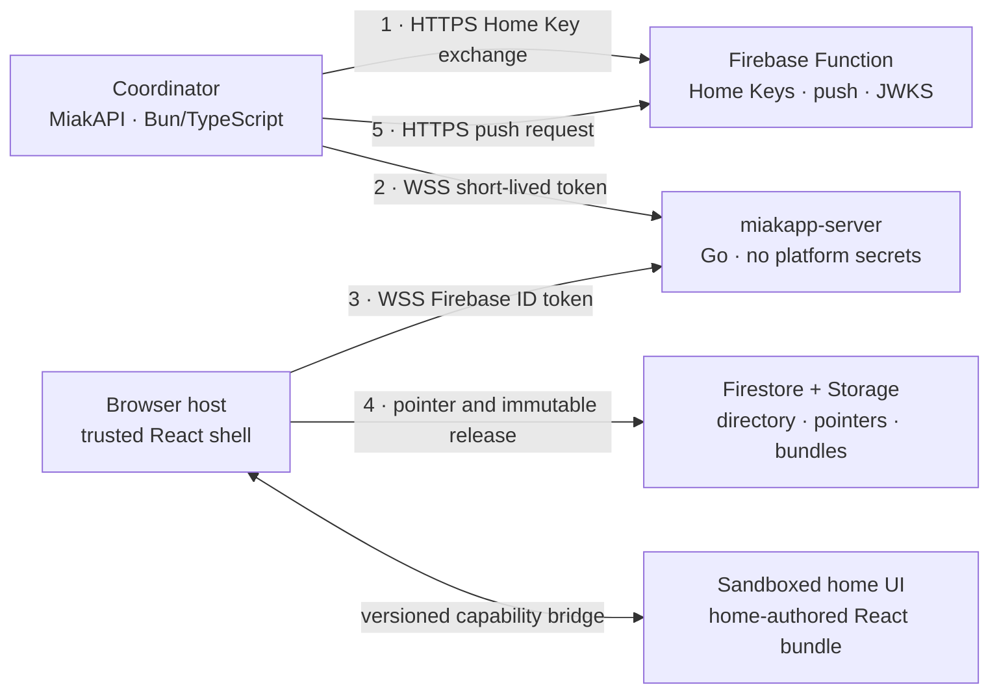

# Miakapp 3.5 — Design

Date: 2026-08-29
Status: architecture direction approved, implementation contracts in progress
Scope: the Miakapp ecosystem. This document is the shared contract between the
web app, `miakapp-server` (rewritten in Go), MiakAPI and the Firebase Functions.
Each repository derives its own implementation plan from it.

The web app's own rebuild and MiakAPI's future shape are not covered here; they
need their own design passes. The exact wire format, component capability bridge,
platform control plane, and migration procedure are explicit design gates. This
document must not be treated as implementation-ready until § 19 is closed.

---

## 1. Context

Miakapp relays a home's state in real time between a **coordinator** (a program
running at the user's home, behind NAT) and **users** (browsers).
`miakapp-server` is the mandatory hop, because the coordinator has no public
address.

Moving to 3.5 changes what the server *is*: it stops being a relay that carries
business logic and becomes a **generic data bridge**. All application logic —
users, permissions, invitations — moves down into the coordinator, which is
written by an AI agent.

### Why a rewrite

Auditing the v3 server surfaced structural defects, not isolated bugs:

| Finding | Detail |
|---|---|
| The "optimised" codec is larger than JSON | Measured: 56 B vs 49 B. `miakode` produces a string, which `Buffer.from()` re-encodes as UTF-8; every character ≥ 0x80 becomes two bytes. |
| The codec does not compute the minimum it thinks it does | `m > c` compares a `number` to a `string`, always `false`. The "minimum" is the first character's code. The round-trip holds by luck. |
| The rate limiter limits nothing | `wsServer.js` writes `.l` and reads `.last` (`undefined`) → `NaN`, so the condition is never true. `.i` stays at 0. |
| Guaranteed memory leak | `Home.destroy()` is never called: a home seen once keeps its Firestore listeners open until restart. |
| Artificial latency floor | Every `COMMIT` resends the full state to every user, re-filtered and re-encoded per socket. No diffing. |
| Useless application-level heartbeat | A round trip every 5 s, when RFC 6455 provides control frames the browser answers inside the network stack. |
| Security | Hard-coded origin allowlist, `firebase-admin@9` (2021), no tests. |

### Deployment shape

Miakapp is not yet deployed at a scale that constrains the migration: there is
no fleet of third-party installations to protect, and the whole dataset fits
comfortably in a single JSON export.

That is what makes a **final platform cutover** viable without a permanent
compatibility layer (see § 16). It does not remove the need for beta, shadow,
canary and rollback validation. A project with third-party operators would have
to decide differently.

---

## 2. What goes away

- `miakode` — replaced by MessagePack plus a path dictionary.
- The application-level `PING`/`PONG` heartbeat — replaced by WebSocket control frames.
- Platform-side groups, permissions, pages and invitations.
- The `relations` Firestore collection and its ~120 lines of rules.
- The Coordinator Secret — replaced by Home Keys.
- The Firestore read in the user authentication path.
- Firebase credentials inside the server.
- `.devcontainer/`, `.vscode/`, and every mention of abandoned tooling.

---

## 3. Target architecture

1. The coordinator exchanges its Home Key for its server address and a short-lived token.
2. It connects to the server with that token.
3. The user connects with their Firebase ID token.
4. The browser host reads the component pointer from Firestore, verifies the
   release, and loads it in a sandboxed, non-credential-bearing context.
5. The coordinator requests a push through the Function.

**The server holds no platform secrets.** It only verifies signatures with
public keys and makes no authenticated outbound calls. It still receives
plaintext home data in 3.5; the selected relay is therefore trusted by the home
for confidentiality and correct routing (§ 4).

---

## 4. Trust model

| Party | Trust | Consequence |
|---|---|---|
| Firebase Auth | identity root | provides `uid` and `email_verified` |
| Firebase Function | platform root | sole holder of platform signing, push and Home Key material |
| Coordinator | trusted within its own home | application permission authority; deployed agent output is reviewed as ordinary privileged code |
| miakapp-server | **platform-untrusted, home-data-trusted** | anyone may host one; never receives a platform secret, but sees plaintext home state |
| Browser host | trusted platform client | holds Firebase identity and enforces the component capability boundary |
| Home UI bundle | untrusted by the platform | executes in a sandbox without ambient Firebase credentials or host-origin authority |

Two properties follow from the server being **platform-untrusted**:

- The Function never talks to it. The coordinator is the caller (§ 5.2).
- The short-lived token carries an `aud` claim naming the destination server;
  otherwise a malicious server could replay a captured token against the
  official server to impersonate the coordinator.

This is not end-to-end encryption. A relay that terminates WSS can observe,
alter, replay, misroute, delay or drop application messages. A home must trust
its selected relay operator for those properties. Making the relay blind would
require a separate end-to-end key, membership, recovery and revocation design;
that work is deferred (§ 17).

---

## 5. Authentication

### 5.1 Users

Firebase ID token, verified **locally** by the server: RS256 signature against
Google's JWKS, cached per the response's `Cache-Control` (several hours). No
network call per connection, no Firestore read.

Verification pins the algorithm and validates `kid`, project `aud`, exact
issuer, non-empty subject, `exp`, `iat` and `auth_time`; signature verification
alone is insufficient. The ordinary local path does not check account
disablement or server-side token revocation.

The server extracts `uid`, `email` and `email_verified`, and forwards the email
to the coordinator **only if it is verified**. Without that rule, anyone can
sign up with someone else's address and claim their invitation.

An established socket does not become unauthenticated merely because the token
presented at `HELLO` expires. The browser therefore refreshes its Firebase ID
token and sends `REAUTH` before expiry (45 minutes by default). Failure closes
the socket. This bounds account-disablement and session-revocation propagation
to the Firebase token lifetime unless a later online revocation check is added.
Home membership changes are independent: the coordinator removes or changes the
user's declarations and the relay applies the change immediately.

### 5.2 Coordinators and CLI

A refresh/access token split:

1. The coordinator calls the Function with its **Home Key** (256 bits, no
   expiry, revocable).
2. The Function verifies the key, rate-limits on the caller's IP, and returns:
   the server host to use, a signed **short-lived token** (5 min TTL, `aud` =
   that host, `sub` = homeID, the key's scopes), and the key's metadata.
3. The coordinator connects to the server and presents the token.
4. The server verifies it against the platform's public key (cached JWKS). It
   makes no authenticated outbound call; public key refresh is the only network
   dependency of verification.
5. Before the five-minute token expires (**four minutes by default**), the
   coordinator re-exchanges its Home Key and pushes the new token over the
   existing socket (`REAUTH`). Failure → disconnect.

Step 5 is what gives revocation a bounded effect on an already-established
connection. The maximum residual access is the reauthentication interval, not
the lifetime of the Home Key.

The CLI uses the exact same exchange with a distinct scope and normally closes
the connection after one operation batch.

**Why not a long-lived signed token**: a stateless token without expiry is
irrevocable by construction. Signature, absence of expiry and revocability are
pairwise incompatible; the refresh/access split is the only way to get all
three.

**Why not a server → Function call**: that would turn the Function into an
oracle queryable by the platform-untrusted relay, with the rate limit keyed on
the server's IP instead of the real caller's.

---

## 6. The 3.5 protocol

### 6.1 Transport

A single binary WebSocket on `wss://<host>/ws`. No fallback in 3.5: seven years
of the existing deployment did not reveal a transport incident. This is
evidence for an initial choice, not a universal availability claim; reconnect
and failure states remain first-class behavior.

Liveness comes from RFC 6455 `ping`/`pong` control frames, sent by the server.
The browser answers inside its network stack, without waking JavaScript.

The server validates the HTTP `Origin` of browser handshakes. Coordinators and
CLI clients authenticate in the first application frame because browser
WebSocket APIs cannot set an arbitrary `Authorization` header.

The version is negotiated in `HELLO` and published in `SERVERS/{host}.version`.
An incompatible client gets an explicit error, never an opaque failure.

### 6.2 Encoding

- **Envelope candidate**: one opcode byte, then unsigned LEB128 varints.
- **Dynamic values**: MessagePack, with the Go and TypeScript libraries locked by
  the protocol RFC after an interoperability and fuzzing spike.
- **Dictionary**: variable paths, event topics and function names are interned
  as integers, announced once per connection.

The dictionary is the primary proposed optimisation. A
`salon.temperature` update is expected to take **6 to 9 bytes** instead of
roughly fifty — not because of the codec, since MessagePack and JSON are within
a few percent of each other, but because the variable's name is no longer
retransmitted. The claim must be reproduced with realistic traces before the
extra framing complexity is accepted.

This is Protobuf's field-number mechanism applied at runtime instead of compile
time. Protobuf itself does not apply here: the data's structure is invented by
the agent at runtime, so no static schema exists.

### 6.3 Candidate frame set

The names and broad opcode ranges below capture the intended capabilities. They
are not the final byte-level contract. The protocol RFC must define every field,
length, bound, state transition, unknown-frame behavior and golden byte sequence
before either implementation treats these layouts as stable.

Every frame starts with an opcode byte.

**Handshake**

| Code | Name | Direction | Payload |
|---|---|---|---|
| `0x00` | `HELLO` | client → server | version u8, role u8, msgpack |
| `0x01` | `WELCOME` | server → client | msgpack |
| `0x02` | `FATAL` | server → client | code u16, optional msgpack |
| `0x03` | `REAUTH` | authenticated client → server | token |
| `0x04` | `REAUTH_OK` | server → client | — |

Roles: `1` user, `2` coordinator, `3` CLI.

User `HELLO`: `{token, home}`.
Coordinator `HELLO`: `{token, name}`.
CLI `HELLO`: `{token}` — same exchange as the coordinator, distinct scope,
short-lived connection.
`WELCOME`: `{session, enrolled, coordinators[], protocol}`.

**Variables**

| Code | Name | Direction | Payload |
|---|---|---|---|
| `0x10` | `DICT` | server → user **and** coordinator | n, then {pathID varint, path} |
| `0x11` | `PATCH` | server → client | n, then {pathID varint, flags u8, value} |
| `0x12` | `SYNC` | coordinator → server | full declaration: n, then {path, value} |
| `0x13` | `SET` | coordinator → server | incremental: n, then {pathID varint, flags u8, value} |
| `0x14` | `ACL` | coordinator → server | n, then {userID, patterns[]} |

`flags` bit 0: deletion.

A coordinator sends `SYNC` with plain paths; the server answers with a `DICT`
assigning the identifiers, which it then uses in `SET`.

`ACL` **fully replaces** the set of entries owned by the sending coordinator,
following the same synchronisation semantics as `SYNC` (§ 8).

**Events**

| Code | Name | Direction |
|---|---|---|
| `0x20` | `EVENT` | topicID varint, msgpack — both directions |
| `0x21` | `SUB` | client → server |
| `0x22` | `UNSUB` | client → server |
| `0x23` | `TOPIC_DICT` | server → client |
| `0x24` | `EVENT_ACL` | coordinator → server; candidate topic visibility declaration |

**Calls**

| Code | Name | Payload |
|---|---|---|
| `0x30` | `CALL` | reqID varint, target varint, fnID varint, msgpack args |
| `0x31` | `RESULT` | reqID varint, flags u8 (bit 0 = final), msgpack |
| `0x32` | `CALL_ERR` | reqID varint, code u16, msgpack |
| `0x33` | `CANCEL` | reqID varint |
| `0x34` | `FN_DECLARE` | coordinator → server: function names served |
| `0x35` | `FN_DICT` | server → client |

`target` is `0` for "the home" (the server routes to the coordinator owning the
function); otherwise it is a user session identifier.

**Presence**

| Code | Name | Direction | Payload |
|---|---|---|---|
| `0x40` | `PRESENCE` | server → coordinator | sessionID varint, userID, event u8 |

Replaces v3's `socketID@userID`.

### 6.4 Calls and streams

`CALL` and `RESULT` carry a request identifier. One call may receive
**several** `RESULT` frames before the one marked final: a plain `ack` is the
degenerate single-response case, while `history(7_days)` can stream. `CANCEL`
aborts an in-flight call without closing the socket.

Calls are **symmetric**: a user calls the coordinator's functions, and the
coordinator calls a specific user session's functions. **The server exposes no
functions at all** — it routes, it does not compute. That is the boundary that
keeps it from growing fat again.

The relay adds authenticated, non-spoofable source metadata when forwarding a
user call. Arguments supplied by the browser can never choose their own UID,
email, home or source session. The coordinator is the final application
authorization authority and must accept or reject every call.

`CANCEL` is cooperative. It means that the caller no longer wants results; it
does not prove that an external or physical side effect was undone.

### 6.5 Delivery and failure semantics

WebSocket ordering exists only within one live connection. In 3.5:

- variable state is convergent: reconnect creates a new connection epoch and
  receives a fresh filtered snapshot before patches;
- calls are not automatically retried by the protocol;
- if a connection disappears after dispatch but before a terminal response, the
  outcome is **unknown**, not failed;
- applications that retry a physical or non-idempotent operation provide an
  idempotency key and a coordinator-side deduplication policy;
- event delivery is live and at-most-once unless a later application contract
  explicitly adds persistence;
- session resumption and durable replay are not implied by request identifiers.

The protocol RFC defines epoch and revision fields, reconnect backoff with full
jitter, terminal call states, deadlines, duplicate handling, and the precise
snapshot-before-patch transition.

### 6.6 Event and operation authorization

An enrolled user is not automatically entitled to every topic or function.

- User-originated events route only to coordinators and carry authenticated
  source metadata; they are never directly broadcast to other users.
- Coordinator-originated events are targeted to a session or filtered through a
  coordinator-declared topic allowlist.
- A user may subscribe only to topic patterns declared for that user.
- A user call reaches the owner of a declared function, which authorizes it using
  the immutable caller metadata.
- An unenrolled user may invoke only the reserved enrollment function.

The exact `EVENT_ACL` and forwarded-call layouts remain a § 19 protocol gate.

---

## 7. Server state

Per home, in memory, with no persistence:

- the coordinator connection(s),
- the user connections,
- the full variable state,
- the path ↔ integer dictionary,
- each user's resolved allowlist, as integer sets,
- in-flight calls,
- event subscriptions.

The server **caches the full state**, which lets it serve a connecting user's
snapshot without waking the coordinator or waiting for a round trip to the home.

A server restart loses nothing durable: everyone reconnects and the coordinators
re-push their state.

Per-home and per-connection budgets bound frame size, decoded container depth
and cardinality, dynamic dictionary entries, queued bytes, subscriptions,
in-flight calls and call duration. A slow consumer is coalesced for replaceable
state and disconnected before its queue can exhaust shared memory. Control and
terminal call frames are never allowed to sit behind an unbounded data stream.

### Allowlists

Exact paths and prefixes (`salon.*`). The coordinator declares them; the server
resolves them once into identifier sets and only re-evaluates when a new path
appears. Hot-path filtering becomes an integer set-membership test.

An entry may name a path that does not exist yet; it will apply when it appears.
Variables and allowlists are two independent namespaces.

The presence of an ACL entry enrols a user even when its pattern list is empty.
This distinguishes an enrolled user with deliberately zero visible variables
from an unknown user.

---

## 8. Multiple coordinators

A home accepts several simultaneous coordinators, each owning a domain — for
example one for users and their rights, others for distinct slices of the data.

This is namespace sharding, not active-active redundancy. Two coordinators must
not concurrently control the same physical actuator merely because the relay
accepts both sockets. Redundancy for a physical effect requires fencing at the
resource boundary and is out of scope for 3.5.

**Identity**: a coordinator connects with a name. Uniqueness on (home, name).
Same name → the previous one is evicted. Different name → they coexist.

**Central rule: a coordinator's declaration fully replaces its own slice.** On
each connection it declares its complete set of variables (`SYNC`); the server
diffs against what that coordinator owned and deletes what disappeared. This is
synchronisation, not merging. An orphaned variable becomes structurally
impossible — the concept does not exist, so there is nothing to clean up.

**Grace period**: on disconnect, a coordinator's variables, functions and ACL
slice are marked stale but kept. If the same named coordinator returns within
the window (30 s by default), a new connection generation replaces the old one,
it re-declares, and users receive only the real diff — which is almost always
nothing. Frames from an evicted generation are rejected. Past the window: purge
the complete slice and notify.

**Ownership regimes**

| Object | Ownership | Collision |
|---|---|---|
| Variables | exclusive | explicit rejection |
| Function names | exclusive | explicit rejection |
| Allowlist entries | owned, additive | union |
| Event topic visibility | owned, additive | union, then per-user filtering |

Explicit rejection is deliberate: two coordinators claiming
`salon.temperature` produce an immediate error rather than a silent overwrite.
The union on allowlists is what lets one coordinator declare rights over
variables owned by another.

The union establishes **no privilege boundary** between coordinators that share
one Home Key, hence one trust domain. The control plane includes coarse scopes
such as coordinator, CLI, push and publishing. Fine-grained scopes restricting
individual namespaces or functions are planned, not implemented.

Events from one coordinator may be received by other subscribed coordinators,
but user delivery remains targeted or ACL-filtered as defined in § 6.6.

The frontend receives the **list** of connected coordinators, not a boolean. The
React component decides what to do with it.

---

## 9. Connection lifecycle

### Coordinator

Connect → token verified → home created in memory if absent → `SYNC` +
`FN_DECLARE` + `ACL` → the server assigns identifiers and broadcasts `DICT` and
`PATCH` to the affected users. Then `REAUTH` before token expiry (four minutes
by default).

### User

Connect → ID token verified locally → `uid` and verified email extracted →
three cases, **none of which closes the socket**:

| Case | `WELCOME` |
|---|---|
| No coordinator | `coordinators: []`, empty dictionary |
| Coordinator present, no explicit ACL entry for user | `enrolled: false`, only `miakapp.join` callable |
| Enrolled user | filtered dictionary and snapshot |

v3 closed the socket on `NO_COORDINATOR`, which triggered a reconnection loop
every second. In 3.5 each of these states is announced, and the frontend leaves
it on its own when the situation changes.

**Connected but not enrolled is a normal state**: it is the door to the
invitation flow (§ 11). `miakapp.join` is a reserved function name and may have
exactly one coordinator owner.

An enrolled browser sends `REAUTH` with a refreshed Firebase ID token before
expiry (45 minutes by default). Reauthentication never changes the immutable
session identifier or lets the browser replace its UID.

**No session resumption in 3.5.** A reconnection costs one snapshot, on the
order of a few kilobytes. The dictionary and a state version number leave the
door open should measurement ever justify it.

---

## 10. React components

Rendered **client-side only**. The relay never carries code.

- Firestore `components/{homeID}` holds a tiny pointer:
  `{ version, abi, url, hash, size }`. That is what the platform host subscribes
  to, which gives live reload.
- The bundle lives in Firebase Storage, under a name containing its hash.

Storage avoids Firestore's document-size limit and makes the bundle immutable
and **cacheable indefinitely**. The trusted publication path uploads and
verifies the object first, then updates the pointer. Upload and pointer update
are not a cross-service transaction, so the order is part of the contract.

### Isolation boundary

The authenticated Miakapp host **does not dynamically import the home bundle
into its own realm**. Imported JavaScript would inherit the host origin and
could read application state, use ambient credentials, mutate the host DOM and
invoke authenticated APIs.

Instead, the host loads the release in a sandboxed, non-credential-bearing
browsing context. A versioned capability bridge is its only interface to:

- the filtered variable snapshot and patches;
- allowed event subscriptions and publications;
- authenticated calls and results;
- navigation and presentation services;
- a Miakapp component/design-system SDK.

The bundle receives no Firebase token, Home Key, raw WebSocket, host storage or
service-worker authority. A hash proves which bytes are running, not that the
bytes are safe; the sandbox is a browser-enforced security boundary. The
component-runtime design pass chooses the isolated origin or opaque-origin
mechanism, CSP, CORS, download authorization, integrity verification and
`postMessage`/`MessageChannel` schema, then proves the boundary with a malicious
bundle.

**JSX is compiled at write time**, never in the browser: Babel standalone weighs
3 MB and starts slowly on mobile. What is stored is ready-to-run ESM.

**Granularity**: one bundle per home. Separate components with an import map
would give more surgical live reload but would require Safari 16.4+, which
contradicts the browser compatibility requirement.

**Read access**: `allow read: if request.auth != null`. The code necessarily
leaks to users — that is the fate of every SPA — but nothing requires allowing
anonymous enumeration of every home. We cannot do better: with `relations` gone,
Firestore has no way to know who belongs to which home. That is the accepted
price of moving permissions into the coordinator. The host does not load a home
release until the relay reports the user as enrolled.

The agent manages its own Git repository as it sees fit; `list_components`,
`get_component`, build, test and publish tools give it control. Publishing is a
privileged platform operation, not a direct client write to the pointer. Should
a central Git repository become desirable later, its release pipeline targets
the same artifact and pointer contract without changing the frontend.

---

## 11. Users and invitations

The platform no longer manages membership. The coordinator is the sole owner of
its user list, stored wherever the agent decides (SQLite, JSON, PostgreSQL).

Invitation flow:

1. The invitee opens `miakapp.com/h/<home>?invitation=<token>`.
2. They create a Miakapp account (Firebase Auth).
3. The platform-owned enrollment UI connects, receives `enrolled: false`, and
   calls the reserved `miakapp.join(token)` function. Home-authored code has not
   been loaded yet.
4. The server routes the call with a non-spoofable `uid` and the email **only if
   verified**.
5. The coordinator validates the invitation against its store and enrols the user.
6. It pushes an explicit ACL entry, which may contain zero visible paths; the
   server sends the dictionary and snapshot.
7. The user-owned frontend writes the home to its bookmark list and loads the
   sandboxed release without reconnecting.

The coordinator must be online for someone to join a home. Acceptable: if it is
offline, the home does not work anyway.

Enrolment security now rests on deployed coordinator code. The relay guarantees
the Firebase identity and never accepts a caller-supplied replacement UID. A
buggy coordinator can still mis-authorise or cause physical effects within its
own home, so enrollment and operation policies require ordinary tests and
release controls even when an agent authored them.

---

## 12. Target Firestore

| Collection | Role | Rule |
|---|---|---|
| `homes/{id}` | directory: name, icon, `owner`, `server` | public `get`, `owner` writes |
| `users/{uid}.homes` | **the user's bookmarks, with no authorisation meaning** | `read, write: if request.auth.uid == userID` |
| `users/{uid}/pushTokens/{token}` | platform push delivery addresses | owning user writes; Function reads through IAM |
| `components/{homeID}` | active release pointer | authenticated reads; publisher Function writes |
| private Home Key registry | hashed key material, scopes, metadata and revocation | Functions/IAM only; exact shape is a control-plane design gate |
| `SERVERS/{host}` | server directory, with `version` | public `list` |

Deleted: `relations`, `homes/*/groups`, `homes/*/pages`,
`homes/*/invitations`, `homes/*/coordinators`.

No `admins` field is introduced: `owner` covers the only operations left at the
platform level, including bootstrap through authenticated Functions.
Coordinator-appointed admins are a later need, which will go through explicit
control-plane capabilities rather than a Firestore membership relation.

`users/{uid}.homes` must remain a bookmark list. Were it ever to become
authoritative, we would have recreated `relations` with two diverging sources of
truth.

---

## 13. Notifications

The FCM token is bound to the Firebase project, not to the home — which is what
makes multi-home work today. Standard Web Push has the same property: a service
worker holds a single subscription, bound to a single application key. Sending a
push therefore requires a **platform identity**, necessarily shared, which can
live neither in a coordinator nor in a self-hosted server.

Sending therefore goes through the Firebase Function. Counter-intuitive
consequence: this extra component is what **frees** `miakapp-server`. Today,
wanting push forces `FIREBASE_CREDENTIALS` into the server — and that is what
makes self-hosting impossible.

Authentication of the sender is straightforward: the Function verifies the
short-lived coordinator token and its push scope. **Recipient authorization is
not yet solved by the Home Key.** The platform no longer stores membership, so a
Home Key proves control of a home but cannot prove that an arbitrary UID belongs
to it.

The control-plane design must bind each push destination to a home with explicit
user consent (for example an opaque, revocable home-scoped push grant) and define
removal, expiry, multi-home behavior and abuse limits. No 3.5 push endpoint ships
with a bare `{homeKey, uid}` authorization check.

---

## 14. Errors

`FATAL` closes the connection; `CALL_ERR` affects only one call.

| Range | Origin |
|---|---|
| 1000–1999 | server: unknown function, no coordinator, not enrolled, timeout, quota |
| 2000–2999 | application: raised by the coordinator |

The split lets the agent tell immediately whether a failure comes from its own
code or from the infrastructure.

Per-connection limits: maximum frame size, in-flight call count, call timeout,
queued bytes, decoded depth/cardinality, dynamic identifiers, subscriptions and
per-IP connection rate — this time actually implemented. The protocol RFC owns
the stable numeric catalogue, retryability and safe user-facing messages.

---

## 15. Testing

Absent in v3; non-negotiable in 3.5.

- **Codec**: round-trip over randomly generated values, including Unicode, large
  integers and nested structures, with explicit JavaScript/Go numeric policy,
  strict decoder limits and coverage-guided fuzzing of malformed input.
- **Protocol conformance**: a golden set of raw-byte frames, checked on both
  encode and decode. It becomes the shared contract between the Go server,
  MiakAPI and the web app.
- **Lifecycle**: test-driven fake coordinator and fake client, covering the three
  `WELCOME` cases, snapshot-before-patch ordering, the grace period, eviction by
  name, generation fencing and collision rejection.
- **Multiple coordinators**: slice synchronisation, allowlist union, absence of
  orphans across disconnect cycles.
- **Authentication**: expired token, wrong `aud`, revocation between two
  `REAUTH` calls, user-token refresh, unverified email, spoofed caller metadata,
  membership removal and per-operation denial.
- **Failure semantics**: disconnect before and after dispatch/result, outcome
  unknown, idempotency, duplicate/replayed requests, coordinator and relay
  restarts, mixed protocol versions and resynchronisation.
- **Backpressure and load**: slow readers, stream floods, reconnect storms,
  end-to-end latency, bounded queue/memory behavior and fairness across homes at
  a few thousand connections.
- **Component isolation**: malicious bundles attempting to read host DOM,
  storage, Firebase credentials, other homes, service workers and undeclared
  network/capability surfaces.
- **Migration**: synthetic equivalents of existing state, actions,
  notifications, persisted context and failure behavior, compared through a
  non-actuating shadow adapter.

---

## 16. Migration

The official 3.5 relay has no permanent v3 compatibility layer. A v3 sidecar
would read `relations` and `groups`, precisely the collections being deleted.
Keeping it alive after migration would require writing membership into two
models in parallel — the divergence problem this refactor eliminates.

That does **not** justify migrating blind. Before the final platform cutover:

1. an isolated beta stack is deployed;
2. a 3.5-compatible Node-RED adapter publishes representative state to both
   systems while beta actuation is disabled or recorded;
3. synthetic and production-shaped behavior is compared;
4. backup and restore are rehearsed;
5. one home canaries the complete stack with explicit rollback criteria.

The migration adapter is temporary coordinator-side tooling, not a legacy
protocol in the new relay. The public Node-RED package may be deprecated and
redirect users to the agent-first onboarding while this private/temporary bridge
protects existing installations.

At final cutover, the Function/control plane, Firestore data and rules,
`miakapp-server`, MiakAPI/coordinator, component release and web app move as one
versioned release set.

Rollback includes a full Firestore export, immutable component artifacts, the
previous rules and Functions, relay/SDK/web release identifiers, coordinator
configuration and the local automation backup. Auth accounts are independent of
the data migration and do not move.

The export must be taken on the day, stored outside the repository, and never
committed.

Final order: verified backup → deploy compatible control plane → migrate data →
deploy rules → relay → coordinator/adapter → component release → web app → run
acceptance checks → commit or roll back. A few hours of downtime is acceptable,
but accepted downtime is not a substitute for a rehearsed rollback.

---

## 17. Out of scope

Planned but not implemented in 3.5:

- Coordinator-appointed admins, able to create and delete Home Keys and to talk
  to the embedded agent.
- A central Git repository for components.
- Session resumption after a drop.
- Fine component granularity with an import map.
- End-to-end encryption through a blind relay.
- Active-active control of the same physical actuator.
- A third-party component marketplace.
- Replacing every existing Node-RED flow.

Each is reachable without breaking the protocol.

---

## 18. Decisions and rationale

| Decision | Rationale |
|---|---|
| Go | simple concurrency model, static deployment artifact, mature profiling and predictable operation for a small relay; performance still has to be measured |
| WebSocket only | broad browser support and seven years without an observed incident; explicit failure UI and reconnect behavior are still required |
| MessagePack, not Protobuf | structure is invented at runtime by the agent; without a schema Protobuf degenerates into `Struct`, larger than MessagePack |
| Path dictionary, conditional | the variable name dominates small updates, but the optimisation ships only if representative benchmarks justify its protocol cost |
| RFC 6455 control frames | the browser answers inside the network stack; the application heartbeat was negative work |
| Refresh / access token | the only construction giving absence of expiry, revocability and secret-free verification at once |
| Coordinator calls the Function | the relay is platform-untrusted; the reverse makes it an oracle and keys the rate limit to the wrong IP |
| `aud` in the short token | anyone may host a server, hence capture and replay a token |
| Declaration replaces the slice | makes orphaned variables structurally impossible, with no cleanup pass |
| Rejection on collision | the agent sees its bug in development, not a silent overwrite in production |
| No permanent relay compatibility | v3 compatibility depended on deleted collections; migration safety comes from beta/shadow/canary tooling instead |
| Sandboxed home UI | a same-origin dynamic import would grant home-authored code the platform application's ambient authority |
| Firestore + Storage releases | immutable artifacts plus a live pointer leave room for a later Git publication source |
| Push in the Function | push identity is necessarily platform-wide; isolating it is what frees the server |
| Temporary Node-RED migration adapter | preserves the working installation as oracle and rollback target without retaining v3 in the relay |

---

## 19. Design gates before implementation

The architecture direction above is stable. These shared contracts are not.
Each must be reviewed in this repository before repository-specific plans may
depend on it.

1. **Protocol RFC** — exact frames, state machine, caller metadata, event ACL,
   revisions, limits, failure semantics, golden fixtures and compatibility.
2. **Component runtime** — sandbox/origin, capability bridge, SDK ABI, artifact
   format, CORS/CSP/integrity, publication, cache, rollback and hostile-bundle
   tests.
3. **Platform control plane** — owner bootstrap, private Home Key registry,
   minimal scopes, signing/JWKS rotation, push grants, publisher authorization,
   quotas and audit.
4. **MiakAPI and agent experience** — public coordinator API, CLI/MCP tools,
   home repository contract, discovery, approvals, testing and deployment.
5. **Migration** — Node-RED bridge, synthetic oracle, beta/shadow topology,
   backup/restore, canary metrics, cutover and rollback runbook.

The first implementation work is limited to disposable interoperability or
sandbox spikes until the corresponding gate is closed. In particular, the Go
relay must not turn the candidate frame table into an accidental permanent
protocol before gate 1 is complete.
